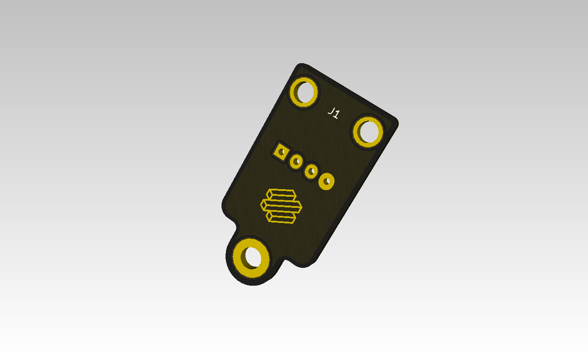

Wolley Interconnect Bus Terminator
==================================

This is the KiCad project for the Wolley Interconnect terminator unit.
The CAN bus in Wolley Interconnect needs to be terminated at each end with a
120 Ohm resistor.

Licence
-------

Licenced under the CERN Open Hardware Licence v1.2.
